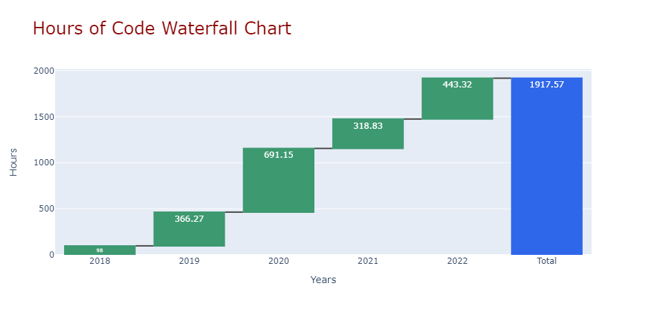

# 10,000 Hours
View on github: **[10000Hours.ipynb](10000Hours.ipynb)**

or

Use nbviewer:  **[https://nbviewer.org/github/dfreeman500/10000-Hours/blob/master/10000Hours.ipynb](https://nbviewer.org/github/dfreeman500/10000-Hours/blob/master/10000Hours.ipynb)**

#
Many people have heard of Malcolm Gladwell's book -- Outliers which popularized the 10,000 hour rule. The 10,000 hour rule indicates that experts become experts because of massive amounts of deliberate practice. Gladwell makes the case that 10,000 hours seems to be the time period it takes to become an expert.

When I started this coding journey in late 2018, I didn't know where it would take me. I knew about the 10,000 hour rule and decided to keep track of how far I traveled on the journey. Usually I would set a timer (ex: I'm going to code for 1 hour) or use a stopwatch. At first, I wrote my times down on paper but then I kept going and decided to transfer to a spreadsheet. **[10000Hours.ipynb](10000Hours.ipynb)** shows my journey of coding across several years. 

For me, "coding" is any deliberate learning which could include actual coding, watching videos/tutorials, getting environment set up, reading about coding or related topics, etc. Sometimes you can get distracted when coding but if I realized I got distracted for any significant amount of time I would subtract an estimated amount off of my coding time. Also, there are plenty of coding times that are not included in these hours. 

#
Thanks to: https://towardsdatascience.com/waterfall-charts-with-plotly-43822918e9eb for a great tutorial on waterfall charts in plotly (see example below - which doesn't seem to be viewable on github as it uses plotly)

 